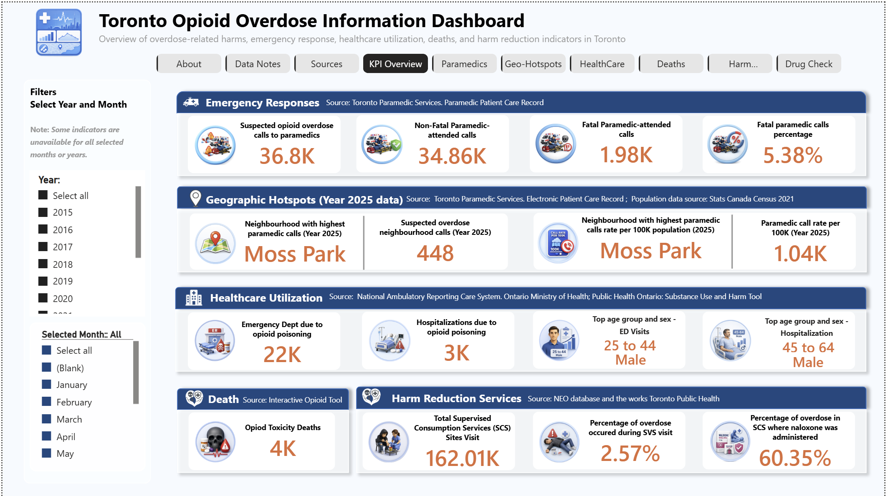
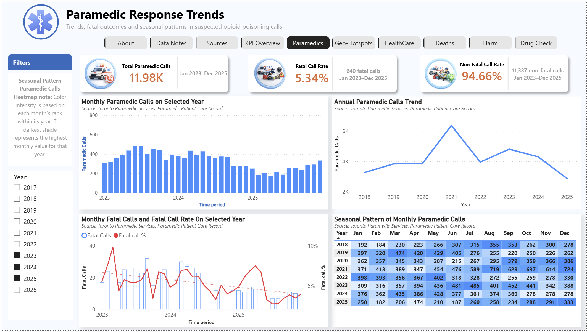
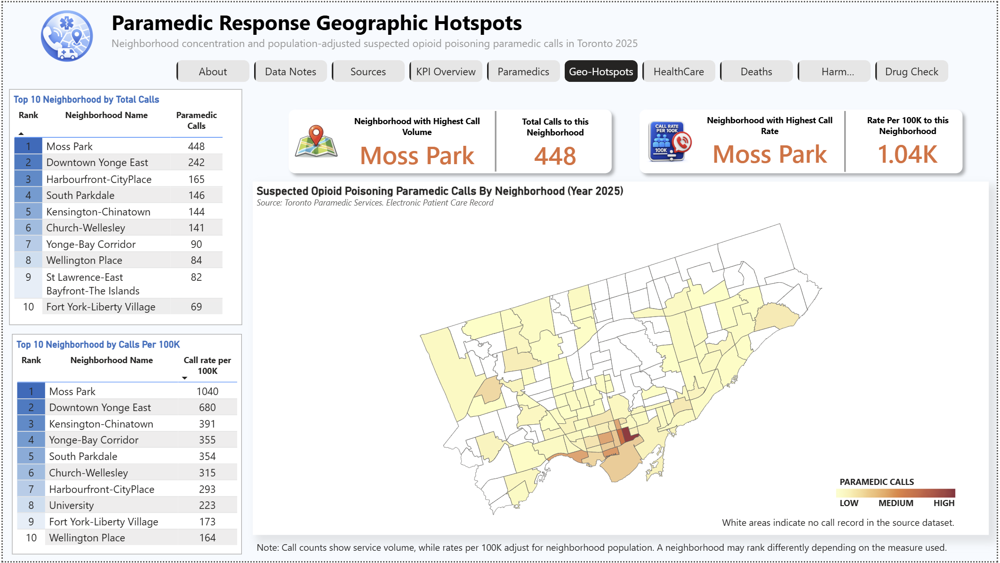
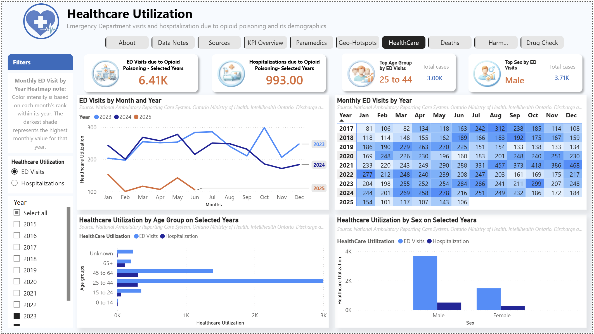
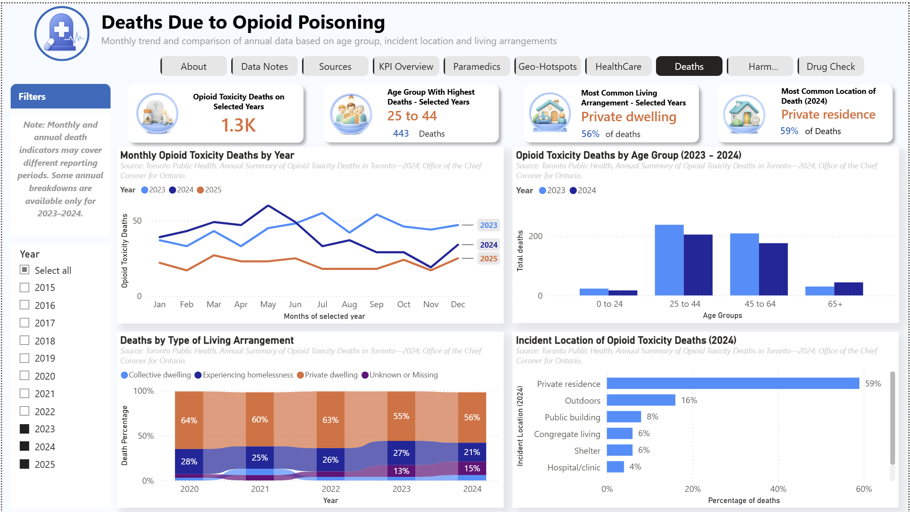
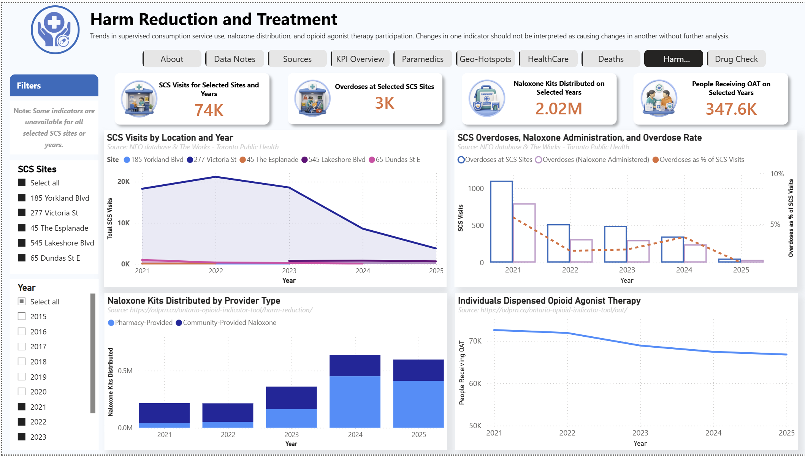
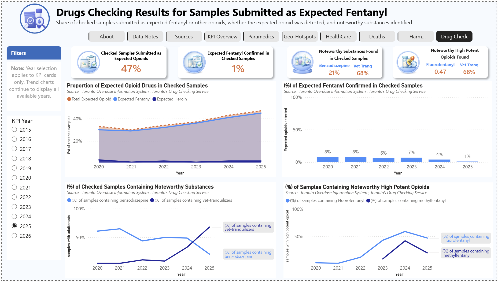

# Toronto Opioid Overdose Information Dashboard

## Project Overview

This project presents an interactive Power BI dashboard examining opioid-related harms and responses in Toronto.

The analysis integrates publicly available indicators covering:

- suspected opioid-overdose paramedic responses;
- neighbourhood-level geographic hotspots;
- emergency department visits and hospitalizations;
- opioid-toxicity deaths;
- supervised consumption services;
- naloxone distribution;
- opioid agonist therapy; and
- drug-checking findings.

The project was developed as a professional analytics case study demonstrating data preparation, data modelling, DAX development, geographic integration, dashboard design, validation, and responsible interpretation of public-health information.

## View the Project

[Read the Full Analytical Report](Toronto-Opioid-Overdose-Analytical-Report.pdf)

[Interactive Power BI dashboard link will be added here.](https://app.powerbi.com/links/gdGUN30REL?ctid=a8eec281-aaa3-4dae-ac9b-9a398b9215e7&pbi_source=linkShare)

## Key Findings

- Suspected opioid-overdose paramedic calls peaked in 2021 and generally declined afterward.
- Calls decreased by approximately 33% from 2024 to 2025.
- No consistent seasonal pattern was identified across complete calendar years.
- Moss Park recorded the highest paramedic-call count and population-adjusted call rate in 2025.
- Emergency department visits and hospitalizations were lower from January to June 2025 than during the same period in 2023 and 2024.
- Adults aged 25–44 and males recorded the highest numbers of opioid-poisoning healthcare encounters.
- Drug-checking findings showed increasing veterinary-tranquilizer detections and continued variability among expected-fentanyl samples.

## Dashboard Pages

### Paramedic Response Trends

Examines monthly and annual suspected opioid-overdose paramedic calls, fatal outcomes, and seasonal patterns.

### Geographic Hotspots

Compares Toronto neighbourhoods using total paramedic-call volume and population-adjusted call rates.

### Healthcare Utilization

Examines opioid-poisoning emergency department visits and hospitalizations by time period, age group, and sex.

### Deaths Due to Opioid Poisoning

Presents monthly mortality trends and selected age-group, living-arrangement, and incident-location characteristics.

### Harm Reduction and Treatment

Examines supervised consumption service activity, naloxone distribution, and opioid agonist therapy.

### Drug-Checking Results

Examines checked samples submitted as expected opioids and selected noteworthy substances detected.

## Tools and Techniques

- Power BI Desktop
- Power Query
- DAX
- Microsoft Excel
- Data cleaning and transformation
- Relational data modelling
- Date and year dimension tables
- Dynamic measures and selectors
- Ranking and Top N analysis
- Choropleth mapping
- Population-adjusted rates
- Partial-year comparisons
- Data validation and quality assurance
- Public-health data interpretation

## My Contribution

I independently completed the project, including:

- locating and evaluating public data sources;
- extracting and restructuring published data;
- cleaning and standardizing datasets;
- designing the Power BI data model;
- developing DAX measures and dynamic selectors;
- integrating Toronto neighbourhood boundaries and census population;
- designing the dashboard interface and navigation;
- validating calculated results against original sources;
- interpreting findings and limitations; and
- writing the accompanying analytical report.

## Important Interpretation Notes

The indicators in this dashboard represent different events, reporting systems, populations, and reporting periods. They should not be added together to estimate a total number of overdose incidents or affected individuals.

Some recent periods contain partial-year data. The analysis is descriptive and observational and does not establish causation.

## Data Sources

The project uses publicly available data from organizations including:

- Toronto Public Health
- Toronto Paramedic Services
- Public Health Ontario
- Office of the Chief Coroner for Ontario
- Ontario Drug Policy Research Network
- Toronto’s Drug Checking Service
- Statistics Canada

Raw source files are not redistributed in this repository. Please access the latest versions directly from the original providers.

## Disclaimer

This project was developed for educational, analytical, and portfolio purposes. It is not an official publication of the City of Toronto, Toronto Public Health, Public Health Ontario, the Ontario Drug Policy Research Network, Toronto’s Drug Checking Service, or any other data provider.
